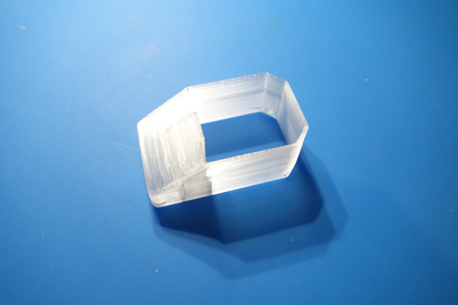

# Front panel for MEAN WELL LRS-350-* PSUs

Printed 3mm thick in PETG to offset for material weaknesses due to print orientation.

TODO: coat it with a UV-blocking paint.

## prints:

* [Main case:](stl/cover.stl)
* [Shield for high voltage wires:](stl/power_shield.stl)

## PCB

* [XT60 'back plane':](pcb/gerb.zip)

## insides:

## type of C14 connector with rocker switch that fits the model:

 

## Separator to shield input and output power, and neutral from live

