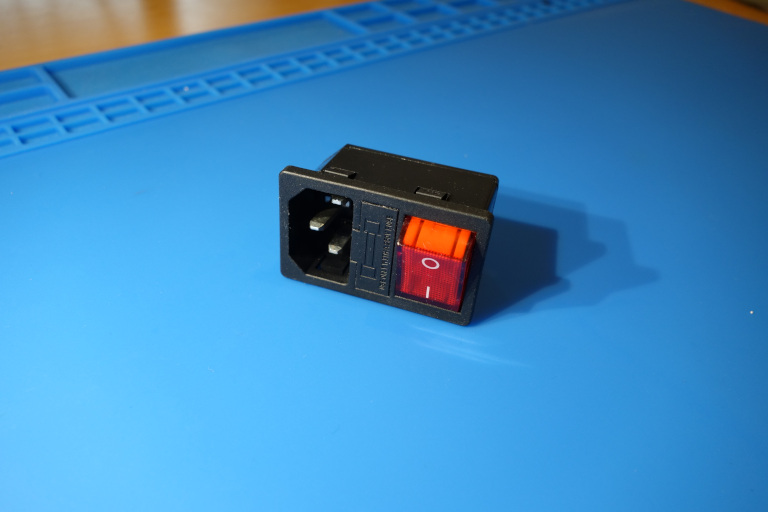

# Front panel for MEAN WELL LRS-350-* PSUs

## prints:

* [Main case:](cover.stl)
* [Shield for high voltage wires:](power_shield.stl)

## insides:

## type of C14 connector with rocker switch that fits the model:

 

